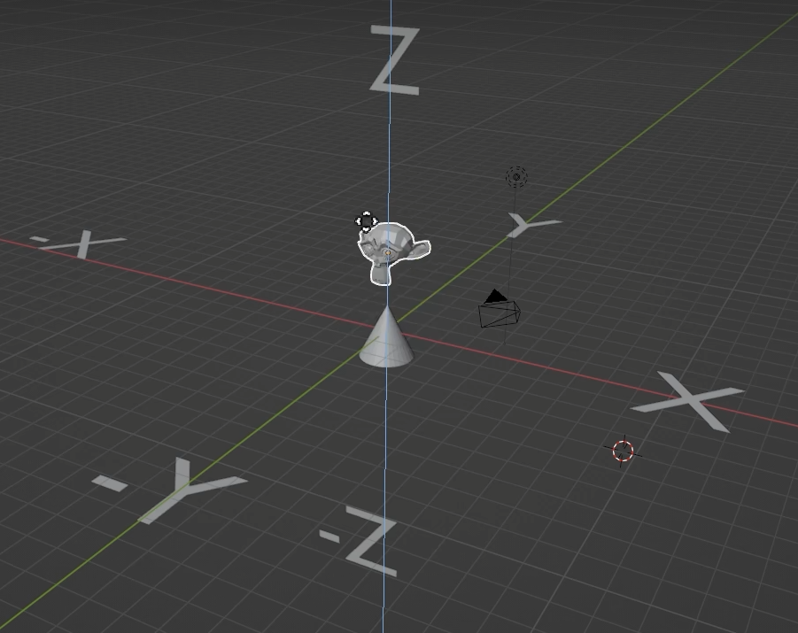
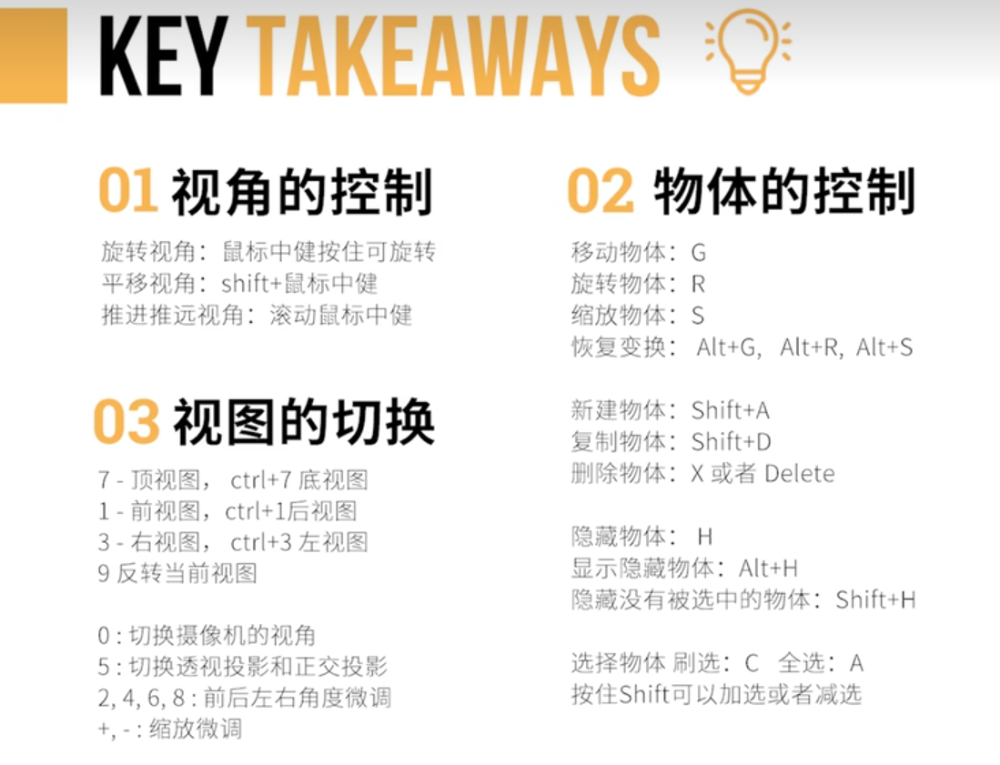
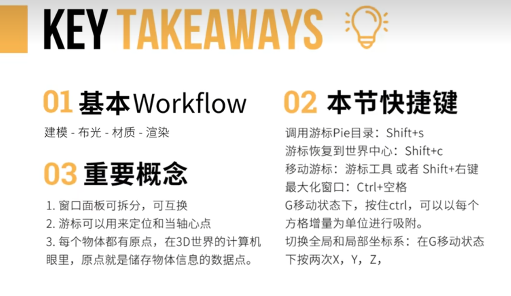

# Blender零基础入门教程

**以下操作笔记主要来源于老师的总结，我进行了操作方法整理。**

### 基础篇 1.2 让手听话

#### 1. 视角的控制

旋转视角:鼠标中健按住可旋转

平移视角: shift+鼠标中健

推进推远视角:滚动鼠标中健

在编辑-偏好设置-视图切换-缩放-选择 缩放至鼠标位置

#### 2. 物体的控制

移动物体:G   旋转物体:R   缩放物体:S

恢复变换: Alt+G, Alt+R, Alt+S

新建物体: Shift+A

复制物体: Shift+D  （移动并复制）

删除物体: X 或者 Delete

隐藏物体: H （或点击小眼睛）  显示隐藏物体:Alt+H

隐藏没有被选中的物体: Shift+H

选择物体 刷选:C  全选:A   按住 Shift 可以加选或者减选

长按选择键可以切换选择方式，比如可以索套切换到框选

#### 3. 视图的切换 （以下均为小键盘）

7-顶视图，1-前视图，3-右视图，9-反转当前视图

0: 切换摄像机的视角

5: 切换透视投影和正交投影

2, 4, 6, 8: 前后左右角度微调（默认15°）

.: 快速跟踪物体

+，- : 缩放微调

### 基础篇 1.3 认识界面

#### 1. 基本workflow

建模 Modeling - 布光 Lighting - 材质 Texturing - 渲染 Rendering

第一性原理：如何回归本质？

#### 2. 本节快捷键

调用游标 Pie 目录（把物体移动到游标位置）: Shift+s

游标恢复到世界中心: Shift+c

移动游标: 游标工具或者 Shift+右键

最大化窗口: Ctrl+空格

G 移动状态下，按住 ctrl，可以以每个方格增量为单位进行吸附。

切换全局（世界）和局部坐标系: 在 G 移动状态下按两次 X，Y，Z，第一次为局部，第二次为全局坐标。

编辑-偏好设置-视图切换-围绕选择物体旋转 打开

在变换轴心点选择选择方式

#### 3. 重要概念

1.窗口面板可拆分，可互换 （在每个窗口四角向内，外拖动），如果想要恢复原本的布局，可以点击 + 号新建一个 General 的 Layout，然后把第一个布局删掉，然后把新建的布局右键向前重排序即可，也可以按两次 Ctrl+空格 恢复布局。

2.游标可以用来定位和当轴心点，游标在哪里新建物体就会出现在哪里，点击游标按钮 Cursor 或者 Shift+右键 移动。

3.每个物体都有原点，在 3D 世界的计算机眼里，原点就是储存物体信息的数据点。（通过选项 “仅影响原点” 移动：Options - Transforms - Affecr Only Origins）

### 基础篇 1.4 珍珠耳环的少女

载入参考图：shift+A  图像-参考
